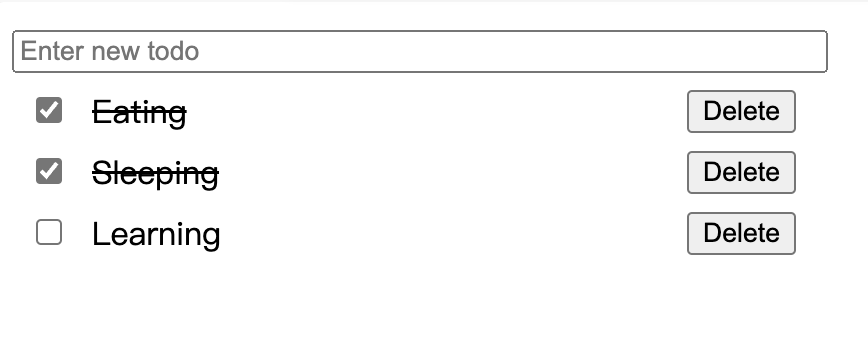
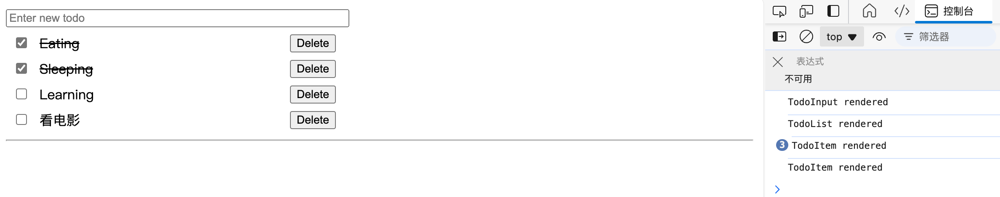
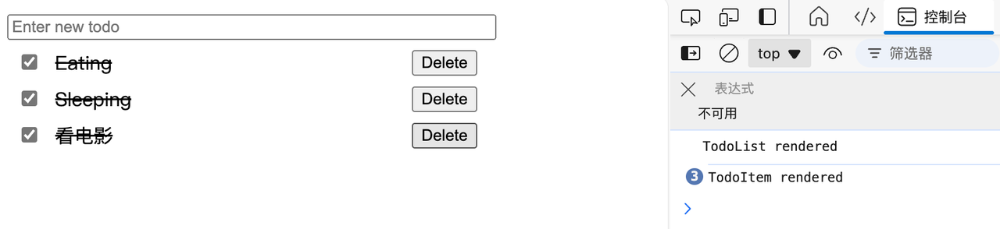
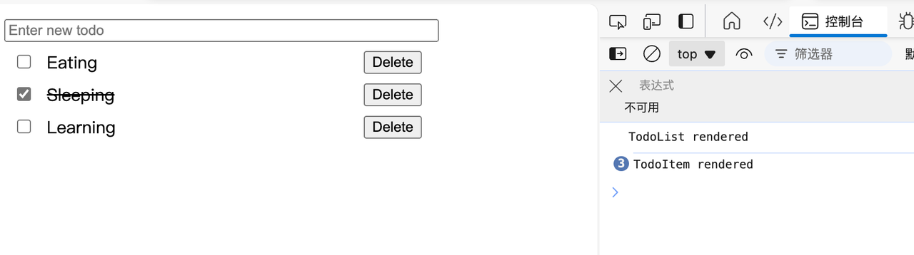
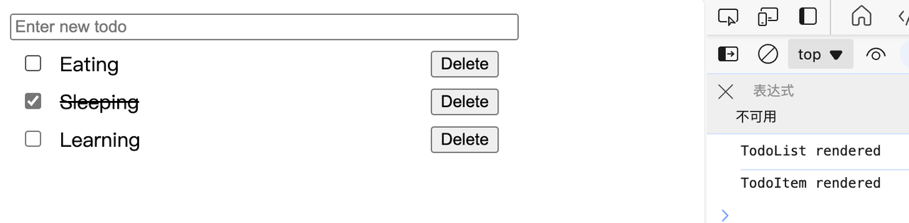
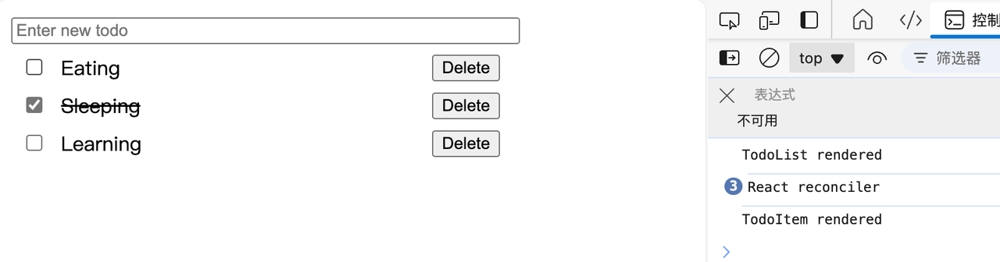
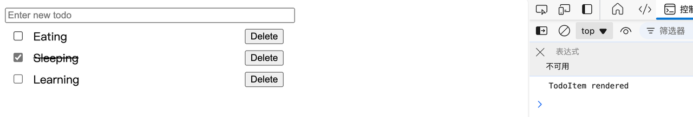

# React组件的渲染机制
在讲如何提升React组件的性能之前，我们要先了解React组件的渲染机制，这样才能知道从哪些方面去优化。
## React组件什么时候会重新渲染
React组件会在以下几种情况下触发重新渲染：
1. 组件内部状态变更
当组件内部的状态发生变化时，会触发该组件重新渲染。
2. 父级组件重新渲染
当父组件重新渲染时，子组件也会跟着重新渲染，即使子组件的props并未发生改变。
频繁且不必要的状态变化和父组件的渲染传播，都会导致性能下降，尤其是在应用较大或渲染复杂UI时。因此，我们在优化组件性能时主要从这两个方面考虑。
## React组件重新渲染时发生了什么
当React检测到组件需要重新渲染时，它会执行以下几个步骤：
1. 生成新的Virtual DOM
React组件重新渲染时，函数组件会重新执行，类组件会调用render方法，然后生成新的虚拟DOM树，也就是React.createElement的产物。
2. Diff算法比较
React算法比较新旧虚拟DOM树，找出需要更新的部分。这个过程会最小化对真实DOM的操作，从而提高性能。
3. 更新DOM
根据Diff算法返回的差异，React只会更新需要变动的DOM部分，而不是重新渲染整个页面。
# 基础优化方式
1. 使用缓存：useMemo和useCallback
React提供了两个钩子函数useMemo和useCallback，用于缓存计算值或回调函数，以避免不必要的重新计算或函数重新创建。
- useMemo: 用于缓存计算结果，只在依赖项发生变化时才会重新计算。这对于复杂的计算过程非常有效，避免在每次渲染时都重复执行计算逻辑。
const computedValue = useMemo(() => expensiveComputation(data), [data]);
- useCallback: 用于缓存回调函数，尤其是当该回调函数依赖于外部数据时。这有助于防止组件每次渲染时都生成新的回调函数，从而避免子组件的无效渲染。
const memoizedCallback = useCallback(() => handleAction(someState), [someState]);
2. 使用计算属性，减少useState的使用
如果某些数据是由其他状态或props计算得来的，尽量避免为这些数据单独维护一个state，而是通过计算或函数衍生出这些值。
const derivedValue = calcComputedValue(stateOne, stateTwo);
3. 减少useEffect的使用，避免在useEffect中调用setState
useEffect通常用于处理副作用，但频繁地在useEffect中调用setState会导致额外的渲染。通过仔细审查useEffect的依赖项，避免多余的状态更新，能够减少不必要的渲染。如果依赖使用不当，就可能会导致死循环。
4. 使用memo或者PureComponent避免子组件不必要的重新渲染
memo是一个高阶组件，它可以缓存函数组件的渲染结果，只有当组件的props发生变化时才会重新渲染（对新旧props进行浅比较）。这对于避免因父组件重新渲染而导致的子组件不必要更新非常有效。
const MyComponent = React.memo(function MyComponent(props) {
   return <div>{props.value}</div>;
});
同时，注意深度比较props和state。如果是复杂的对象或数组，可以结合useMemo和useCallback来优化。
5. 合理拆分组件
将大组件拆分为多个小组件，确保每个组件只关心自己的状态和props。这种方式不仅有助于代码的维护，还可以控制每个小组件的渲染频率，减少整个页面的渲染次数。
# 实践
## TodoList应用
我们通过一个简单的TodoList应用来了解下一些基础的优化手段，本次TodoList应用实现的功能有：
1. 一个输入框：添加todo
2. todo列表渲染
3. 更新todo状态（完成或未完成）
4. 删除todo
比较简单，我直接给出第一版，主要代码如下：
```tsx
import { useState } from "react";
import { ITodo } from "../../../types";
import { DEFAULT_TODO_LIST } from "../../../constants";
import { getRandomId } from "../../../utils/uuid";
import { TodoInput, TodoList } from "../../../components/todo-app";

export const TodoApp: React.FC = () => {
  const [todoList, setTodoList] = useState<ITodo[]>(DEFAULT_TODO_LIST);

  const findTodoById = (id: string) => {
    return todoList.find((todo) => todo.id === id);
  };

  const findTodoByName = (name: string) => {
    return todoList.find((todo) => todo.name === name);
  };

  const handleAddTodo = (name: string) => {
    if (!findTodoByName(name)) {
      const newTodo: ITodo = {
        id: getRandomId(),
        name,
        completed: false,
      };
      setTodoList([...todoList, newTodo]);
    }
  };

  const handleDeleteTodo = (id: string) => {
    if (findTodoById(id)) {
      setTodoList(todoList.filter((todo) => todo.id !== id));
    }
  };

  const handleToggleTodo = (id: string) => {
    if (findTodoById(id)) {
      setTodoList(
        todoList.map((todo) => {
          if (todo.id === id) {
              return {
                ...todo,
                completed: !todo.completed,
              };
          }
          return todo;
        })
      );
    }
  };

  return (
    <div className="todo-app" style={{ width: 400, padding: 12 }}>
      <div className="todo-app-header">
        <TodoInput onAddTodo={handleAddTodo} />
      </div>
      <div className="todo-app-main">
        <TodoList
          todoList={todoList}
          onDelete={handleDeleteTodo}
          onToggle={handleToggleTodo}
        />
      </div>
    </div>
  );
};
```
效果：



## 基础优化
我们看下有哪些地方需要优化。
新增一个todo:



更新todo状态：



删除todo:



我们发现这几个操作都有个共同点，就是执行操作以后每个列表项都重新渲染了，但实际上我们这些操作都是针对单个todo的。
优化比较容易，直接将每个列表项用memo包起来。
点击checkbox:



发现并没有什么变化，这是为什么呢？



原因就在这里，当点击checkbox后，会更新todoList，进而触发TodoApp组件渲染，这两个函数就会被重新声明，导致转给TodoList组件的prop变更了，因此TodoList组件及TodoItem组件也会重新渲染。
这个问题怎么优化呢？
我们首先可以想到使用useCallback，但是很显然，由于这两个函数里都用到了todoList状态，我们必须把todoList作为依赖传给useCallback，同样不会起到作用。
我们此时想想，这个todo-list应用渲染更新的根本原因是什么，没错，就是todoList这个状态。每次setTodoList就会导致组件重新渲染。那么，能否避免todoList变更触发组件渲染呢，这听起来好像有点荒谬，因为整个应用就是依赖于这个状态。换种说法，我们能否不通过setTodoList，而是通过其它途径触发组件渲染呢？
必须可以！此时，需要请出useRef这个hook了，我们将todoList用useRef存起来，不过由于useRef不会触发组件重新渲染，我们需要额外定义一个state，通过更改这个state来触发组件渲染：
```tsx
import { memo, useCallback, useRef } from "react";
import { ITodo } from "../../../types";
import { DEFAULT_TODO_LIST } from "../../../constants";
import { getRandomId } from "../../../utils/uuid";
import { TodoInput, TodoList } from "../../../components/todo-app";
import { useForceUpdate } from "../../../hooks/useForceUpdate";

const MemoedTodoList = memo(TodoList);
const MemoedTodoInput = memo(TodoInput);

export const TodoApp: React.FC = () => {
  const forceUpdate = useForceUpdate();
  const todoListRef = useRef<ITodo[]>(DEFAULT_TODO_LIST);

  const findTodoById = (id: string) => {
    return todoListRef.current.find((todo) => todo.id === id);
  };

  const findTodoByName = (name: string) => {
    return todoListRef.current.find((todo) => todo.name === name);
  };

  const handleAddTodo = useCallback((name: string) => {
    if (!findTodoByName(name)) {
      const newTodo: ITodo = {
        id: getRandomId(),
        name,
        completed: false,
      };
      todoListRef.current = [...todoListRef.current, newTodo];
      forceUpdate();
    }
  }, []);

  const handleDeleteTodo = useCallback((id: string) => {
    if (findTodoById(id)) {
      todoListRef.current = todoListRef.current.filter(
        (todo) => todo.id !== id
      );
      forceUpdate();
    }
  }, []);

  const handleToggleTodo = useCallback((id: string) => {
    if (findTodoById(id)) {
      todoListRef.current = todoListRef.current.map((todo) => {
        if (todo.id === id) {
          return {
            ...todo,
            completed: !todo.completed,
          };
        }
        return todo;
      });
      forceUpdate();
    }
  }, []);

  return (
    <div className="todo-app" style={{ width: 400, padding: 12 }}>
      <div className="todo-app-header">
        <MemoedTodoInput onAddTodo={handleAddTodo} />
      </div>
      <div className="todo-app-main">
        <MemoedTodoList
          todoList={todoListRef.current}
          onDelete={handleDeleteTodo}
          onToggle={handleToggleTodo}
        />
      </div>
    </div>
  );
};
```
useForceUpdate比较简单：
```tsx
import { useState } from "react";

export function useForceUpdate() {
  const [, setState] = useState({});

  return () => setState({});
}
```
用了useRef存储todoList后，这几个函数就都只会声明一次了。看看效果：



现在，就只有一个TodoItem重新渲染了。
## 更高级一点的优化
上面一节介绍了如何使用memo优化组件渲染，在大部分场景下优化到这里其实已经够用了。但上一节的todo-list应用仍然还有优化空间，如果感兴趣的话，请继续阅读下去。
首先，在TodoList组件里的map回调函数里加上一段console.log：
```tsx
import { ITodo } from "../../types";
import { TodoItem, TodoItemProps } from "./todo-item";

export interface TodoListProps extends Omit<TodoItemProps, "todo"> {
  todoList: ITodo[];
}

export const TodoList: React.FC<TodoListProps> = ({
  todoList,
  onDelete,
  onToggle,
}) => {
  console.log("TodoList rendered");
  return (
    <div>
      {todoList.map((todo) => {
        console.log("React reconciler");
        return (
          <TodoItem
            key={todo.id}
            todo={todo}
            onDelete={onDelete}
            onToggle={onToggle}
          />
        );
      })}
    </div>
  );
};
```
点击checkbox：


我们发现，控制台输出了3次'React reconciler'。不用担心，这在大部分场景下算不上是什么问题，这本质上是React的设计决定的， 但这确实也是一个可以优化的点。想一想，我们只是更新了一个todo的状态，却触发了React对整个todo列表的协调过程，这个协调过程是比较昂贵的（特别是数据量较大的情况下）。
这种情况下我们能否避免这个协调过程呢？
当然可以的。在TodoList组件中，我们是通过使用props里的todoList状态渲染列表的。想想为什么这么做，比较直观，因为todoList状态里存有每个todo的相关信息，我们要将每个todo传递给对应的TodoItem组件。当todoList状态变更时，例如某个todo的状态变更，会触发TodoList组件的重新渲染，即使每个TodoItem组件都使用memo优化了，TodoList组件仍然会有一个调和的过程（React并不能直接判断具体哪个组件需要重新渲染）。
针对这个问题，这里有两种不同的解决方案，第一种是让TodoItem组件自己去拿自己的信息，第二种是依赖追踪。下面将通过zustand和mobx分别介绍这两种方案。

**下面不会详细介绍zustand以及mobx，感兴趣的同学可以去对应官网了解**
### zustand
TodoItem组件的更新不通过TodoList来实现，也就是TodoItem组件更新不触发TodoList重新渲染。
在TodoList组件中，我们通过遍历todoList来渲染所有列表项，然后将每个todo数据向下传递。当某个todo更新后，todoList也会更新，TodoList组件就会重新渲染。现在，我们要让每个TodoItem组件去拿自己的todo信息，那么，在TodoList组件里就不应该使用todoList状态去渲染列表了。那应该用什么呢，每个todo的id组成的数组！todo的id是唯一确定不可能改变的数据。
至此，我们可以确定两个状态了，第一个就是id数组，第二个就是存储有todo信息的对象，方便根据id查询对应todo，这个对象可以是数组，普通对象，哈希表等。为了有较好的查询效率，下面使用Map。
整个store内容比较简单，稍微要注意的是当新增和删除todo时，我们需要更新两个状态。
```ts
import { create } from "zustand";
import { ITodo } from "../../types";
import { getRandomId } from "../../utils/uuid";
import { DEFAULT_TODO_LIST } from "../../constants";

interface TodoAppStore {
  todoDatabase: Map<string, ITodo>;
  todoIds: string[];

  addTodo: (name: string) => void;
  deleteTodo: (id: string) => void;
  toggleTodo: (id: string) => void;
}

const DEFAULT_DATABASE: Map<string, ITodo> = new Map();

DEFAULT_TODO_LIST.forEach((todo) => {
  DEFAULT_DATABASE.set(todo.id, todo);
});

export const useTodoAppStore = create<TodoAppStore>((set, get) => ({
  todoIds: DEFAULT_TODO_LIST.map((todo) => todo.id),
  todoDatabase: DEFAULT_DATABASE,

  addTodo(name: string) {
    const { todoIds, todoDatabase } = get();
    for (const id of todoIds) {
      if (todoDatabase.get(id)?.name === name) {
        return;
      }
    }
    const newId = getRandomId();
    const newTodo = { id: newId, name, completed: false };
    todoDatabase.set(newId, newTodo);
    set({
      todoIds: [...todoIds, newId],
      todoDatabase,
    });
  },
 
  deleteTodo(id: string) {
    const { todoIds, todoDatabase } = get();
    if (todoDatabase.delete(id)) {
      set({
        todoIds: todoIds.filter((todoId) => todoId !== id),
        todoDatabase,
      });
    }
  },
 
  toggleTodo(id: string) {
    const { todoDatabase } = get();
    const todo = todoDatabase.get(id);
    if (todo) {
      set({
        todoDatabase: todoDatabase.set(id, {
          ...todo,
          completed: !todo.completed,
        }),
      });
    }
  },
}));
```
store定义好了，我们来改造TodoList和TodoItem组件：
TodoList:
唯一区别就是将todoList换成了todoIds，不直接将具体todo传给TodoItem组件。
```tsx
const TodoList = memo<TodoListProps>(
  ({ todoIds, onToggle, onDelete }) => {
    console.log("TodoList rendered");
    return (
      <div>
        {todoIds.map((id) => {
          console.log("React reconciler");
          return (
            <TodoItem
              key={id}
              id={id}
              onDelete={onDelete}
              onToggle={onToggle}
            />
          );
        })}
      </div>
    );
  }
);
```
TodoItem:
根据id去获取对应的todo，这样在其他的todo更新后不会影响到自己。
```tsx
const TodoItem = memo<TodoItemProps>(({ id, onToggle, onDelete }) => {
  const todo = useTodoAppStore((s) => {
    return s.todoDatabase.get(id)!;
  });
  return <CommonTodoItem todo={todo} onDelete={onDelete} onToggle={onToggle} />;
});
```
看看效果：


现在点击checkbox 就没有触发TodoList的协调了。
### mobx
mobx相比于其他状态管理库，在设计上有较大差别。我们在上面有提到React通过setState触发组件重新渲染，并不能直接判断具体哪个组件需要更新。但是，借助mobx我们能够轻松改变这个现状，这也是mobx非常哇塞的一个点，依赖追踪！
在React中使用mobx需要两个库，mobx和mobx-react-lite，前者是mobx的核心，与框架无关，后者作用是将mobx和React组件关联起来。
mobx定义一个store也非常简单：
```ts
import { makeAutoObservable } from "mobx";
import { ITodo } from "../../types";
import { DEFAULT_TODO_LIST } from "../../constants";
import { getRandomId } from "../../utils/uuid";

export class TodoAppStore {
  todoList: ITodo[];

  constructor() {
    this.todoList = DEFAULT_TODO_LIST;
    makeAutoObservable(this);
  }

  private _findTodoById(id: string) {
    return this.todoList.find((todo) => todo.id === id);
  }

  private _findTodoByName(name: string) {
    return this.todoList.find((todo) => todo.name === name);
  }

  addTodo = (name: string) => {
    if (!this._findTodoByName(name)) {
      this.todoList.push({
        id: getRandomId(),
        name,
        completed: false,
      });
    }
  };

  deleteTodo = (id: string) => {
    if (this._findTodoById(id)) {
      this.todoList = this.todoList.filter((todo) => todo.id !== id);
    }
  };

  toggleTodo = (id: string) => {
    const todo = this._findTodoById(id);
    if (todo) {
      todo.completed = !todo.completed;
    }
  };
}
```
在组件中使用store：
```tsx
import { observer } from "mobx-react-lite";
import type { TodoAppStore } from "../../stores/mobx/todo-app";
import { TodoItem } from "../todo-app";

interface TodoListProps {
  todoAppStore: TodoAppStore;
}

const MobxTodoItem = observer(TodoItem);

export const TodoList = observer<TodoListProps>(({ todoAppStore }) => {
  return (
    <div>
      {todoAppStore.todoList.map((todo) => {
        console.log("React reconciler");
        return (
          <MobxTodoItem
            key={todo.id}
            todo={todo}
            onDelete={todoAppStore.deleteTodo}
            onToggle={todoAppStore.toggleTodo}
          />
        );
      })}
    </div>
  );
});
```
observer是一个高阶组件，将store状态与组件关联起来，当状态变更时，自动触发组件更新，内部默认使用memo包裹了组件。
最终效果跟zustand实现的效果一样，但性能会优于zustand。